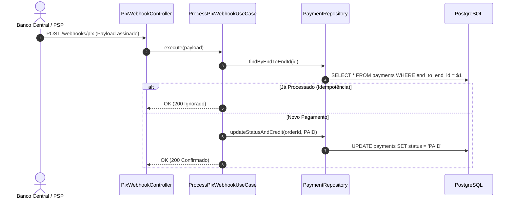

# Example 01: Full Stack Payment Integration PR

## Input Scenario
User request:
> "Prepare a PR description for the branch `feat/pix-instant-payment` that adds PIX payment callback handling and status updates."

Git diff touches:
- `src/domain/entities/payment.ts`
- `src/application/use-cases/process-pix-webhook.use-case.ts`
- `src/infrastructure/repositories/payment.repository.ts`
- `migrations/20261001_add_pix_end_to_end_id.sql`
- `tests/integration/pix-webhook.integration.test.ts`

---

## Generated Output

```markdown
# [PR] Integração de Webhook e Liquidação Instantânea via PIX

## 🚪 Triagem de Decisão & Raio de Explosão
- **Classificação**: 🔴 **Porta de Mão Única (Irreversível / Alto Risco)**
- **Nível de Risco (Blast Radius)**: Tier 1 (Transação Financeira e Alteração de Banco)
- **Justificativa**: A alteração adiciona mutação de saldo e campo de idempotência no banco de dados. Uma falha de liquidação duplicada geraria inconsistência financeira irreversível.
- **Rollback Viável**: Requer script de reversão de migração e congelamento temporário do endpoint de webhook se revertido em produção.

---

## 🗺️ Visão Arquitetural das Alterações (Show Me)



---

## 🎯 Objetivo & Motivação
Implementa o fluxo de processamento de confirmação de pagamento instantâneo via PIX. 
Resolve o problema de reconciliação manual de pedidos pagos, garantindo que o status do pedido transite para `PAID` em menos de 2 segundos após a liquidação no PSP parceiro.

### Principais Alterações:
1. **Idempotência Estrita**: Criação de índice único no banco de dados pelo `end_to_end_id` para evitar pagamento duplicado sob retentativas de rede.
2. **Caso de Uso Profundo**: Encapsulamento da validação de assinatura HMAC e transição de estado da entidade `Payment`.
3. **Testes de Integração**: Testes de ponta a ponta simulando retentativas simultâneas de webhook.

---

## 🔍 Guia para o Revisor ("Por onde começar")
1. Comece pela migration `migrations/20261001_add_pix_end_to_end_id.sql` para checar o índice único.
2. Inspecione a regra de idempotência em `src/application/use-cases/process-pix-webhook.use-case.ts`.
3. Valide o teste de corrida em `tests/integration/pix-webhook.integration.test.ts`.

---

## 🧪 Como foi testado?
- [x] Testes de unidade em `payment.spec.ts` validando transições de estado inválidas
- [x] Teste de integração em `pix-webhook.integration.test.ts` usando Testcontainers Postgres
- [x] Teste de carga simulando 5 webhooks duplicados em paralelo para o mesmo pedido (idempotência garantida)
```
