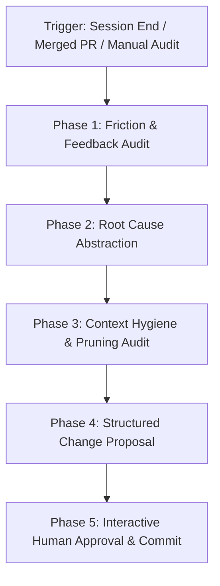

# Retrospective Agent

The `retrospective-agent` is an autonomous cognitive skill designed to create a continuous compound learning loop in AI-assisted software engineering. Instead of treating every coding session or PR review as an ephemeral event, this skill extracts root-cause lessons, formalizes them into actionable guidelines, and maintains the hygiene and density of your repository's AI memory files (`coding-standards.md`, `AGENTS.md`, `CLAUDE.md`).

---

## When to Activate

Activate this skill when:
- Concluding a multi-step coding session or complex bug fix.
- A Pull Request / Merge Request has been merged after significant review comments.
- An agent got stuck in repetitive loops or made preventable architectural mistakes.
- Periodically (e.g. bi-weekly) to audit and prune rules in `AGENTS.md` and `coding-standards.md` to prevent context pollution.
- The user requests: "faça uma retrospectiva da sessão", "extraia aprendizados deste PR", "atualize o coding-standards", "pode auditar nossas regras de IA", or "run a retrospective".

---

## Retrospective Pipeline



### Phase 1: Friction & Feedback Audit
1. **Inspect Session History**: Review the agent trajectory, tool execution errors, failed test runs, and backtracking moments.
2. **Inspect Review Comments**: If auditing a PR/MR, parse all inline comments from human reviewers or automated review bots.
3. **Filter Signal from Noise**: Discard one-off typos or trivial syntax fixes that are handled by formatters. Focus on architectural misunderstandings, missing invariants, fragile test strategies, and performance traps.

### Phase 2: Root Cause Abstraction
Transform concrete grievances into durable, generalized principles:
- Why did the agent/developer make this choice?
- Was an existing guideline ambiguous, missing, or contradicted?
- Could a clear heuristic or negative constraint have prevented the issue entirely?

### Phase 3: Context Hygiene & Pruning Audit
Before proposing new rules, inspect existing documentation (`coding-standards.md`, `AGENTS.md`, etc.):
- **Linter Rule Check**: Can any existing or new rule be moved to an automated linter (ESLint, Biome, TypeScript compiler)?
- **Deprecation Check**: Are there rules referencing frameworks, tools, or folders no longer in use?
- **Compression Check**: Can 3-4 specific rules be merged into a single high-level invariant?
- Keep rule files dense and high-signal (< 250 lines for optimal LLM attention).

### Phase 4: Structured Change Proposal
Present findings in a structured Markdown report:

```markdown
## 🧠 Session Retrospective & Compound Learning Report

### 🔍 Key Friction Points Detected
- **Issue 1**: [Description of friction / review bottleneck]
  - *Root Cause*: [Why it happened]
  - *Proposed Heuristic*: [Actionable guideline]

### ✂️ Rule Pruning & Hygiene
- **[REMOVE]**: [Obsolete or linter-replaceable rule]
- **[CONSOLIDATE]**: [Merged rules for token savings]

### 📝 Proposed Document Updates
- **File**: `coding-standards.md` (or `AGENTS.md`)
  - *Diff Preview*:
  ```diff
  + ### New Guideline Title
  + Guideline explanation...
  ```
```

### Phase 5: Interactive Human Approval
In accordance with repository governance:
- **NEVER** apply changes to `coding-standards.md` or `AGENTS.md` unilaterally.
- Present the diff and rationale to the user in Brazilian Portuguese.
- Solicit explicit confirmation before writing or committing changes.

---

## References

- [Compound Learning & Institutional Memory](references/compound-learning.md)
- [Rule Pruning & Context Health](references/rule-pruning.md)
