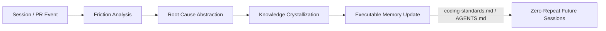

# Compound Learning & Institutional Memory

## The Compound Engineering Problem

In conventional software development with AI agents:
1. **Amnesia**: Every new chat or subagent session starts from zero context, repeating mistakes already debugged in previous sessions.
2. **Review Churn**: Reviewers keep leaving the exact same feedback on PRs (e.g. missing transactions, unindexed foreign keys, improper mock assertions, incorrect import conventions).
3. **Implicit Tribal Knowledge**: Best practices live in senior engineers' heads or fragmented Slack threads rather than in executable agent memory.

The **Compound Learning Cycle** transforms every PR, review comment, and debugging session into an institutional asset.

---

## The 4 Stages of Retrospective Analysis

### Stage 1: Signal Gathering (Friction Detection)
Inspect the following artifacts for recurring pain points:
- **PR Inline Comments**: Look for comments indicating style corrections, forgotten edge cases, test fragility, or architectural mismatches.
- **Agent Session Transcripts**: Look for retry loops, linter/compiler failures, backtracking steps, or hallucinated APIs.
- **Git Commit Sequences**: Identify "fixup", "wip", "oops", or rapid patch commits that signal initial missteps.

### Stage 2: Root Cause Abstraction
Distinguish between superficial symptoms and systemic patterns:
- *Superficial*: "Agent forgot to add `.catch()` on line 42."
- *Systemic*: "The project uses async handlers without an Express async-error middleware or centralized Result monad."
- *Superficial*: "Reviewer asked to rename `getData()` to `fetchUserProfile()`."
- *Systemic*: "The codebase lacks an explicit naming standard for I/O vs in-memory transformations."

### Stage 3: Knowledge Crystallization
Format the extracted lesson into an unambiguous, agent-actionable heuristic:
- **Negative Rule (What to avoid)**: "NEVER instantiate Prisma Client directly inside repository methods; always inject `PrismaService`."
- **Positive Heuristic (What to do instead)**: "When querying partitioned tables by date, ALWAYS include `partition_key` in the `WHERE` clause."
- **Decision Matrix**: "Use in-memory state for UI modals; use URL search params for page filtering."

### Stage 4: Insertion Target Selection
Determine where the crystallized rule belongs:
- **`coding-standards.md`**: For codebase conventions, architecture boundaries, API patterns, error handling paradigms, and testing guidelines.
- **`AGENTS.md` / `CLAUDE.md` / `.cursorrules`**: For tool execution guidelines, file paths, build commands, and environmental idiosyncrasies.
- **Skill-specific references**: For domain-specific depth (e.g., adding an anti-pattern to `clean-architecture` or a lock recipe to `migration-reviewer`).
