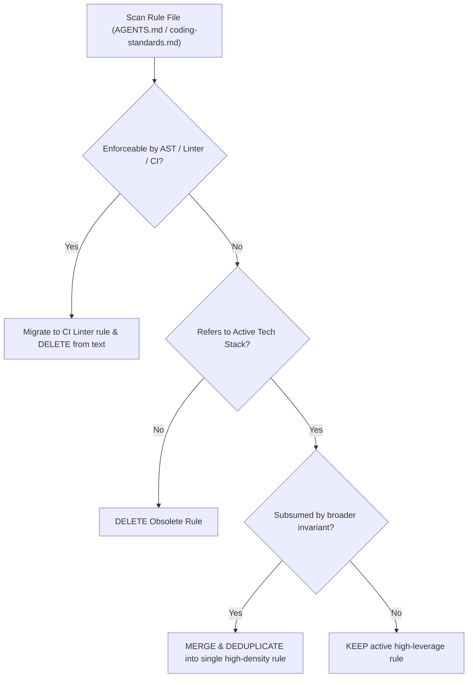

# Rule Pruning & Context Health

## The Context Pollution Dilemma

While compound learning creates valuable institutional memory, unchecked accumulation of instructions leads to **Instruction Decay** and **Attention Saturation**:
- Long rule files dilute critical constraints.
- LLMs exhibit the *Lost in the Middle* phenomenon when system prompts exceed ideal density.
- Contradictory or obsolete rules confuse agents, producing analysis paralysis or non-deterministic behavior.

To maintain maximum agent performance, **every addition must be balanced with ruthless pruning**.

---

## Pruning Heuristics

### 1. The Linter Replacement Rule
> *If a rule can be deterministically verified by an automated tool (ESLint, Prettier, Biome, TypeScript compiler, Ruff), it does NOT belong in natural language agent instructions.*

- **Bad**: "Ensure 2 spaces indentation and trailing commas in JSON."
- **Good**: Configure Prettier / Biome in CI and remove the text rule.

### 2. The Obsolete Tech Rule
> *If a rule refers to a framework, library, pattern, or directory that has been deprecated or migrated, purge it immediately.*

- Example: Remove rules about AngularJS `$scope` after the codebase migrated to React.
- Example: Remove rules about Knex migrations if the repository now exclusively uses Prisma.

### 3. The Redundancy Compression Rule
> *Consolidate multiple narrow rules into a single overarching architectural invariant.*

- Instead of 5 rules:
  1. "Don't import database in Controller."
  2. "Don't call SQL queries in Use Case."
  3. "Don't import Express in Domain."
  4. "Don't use TypeORM entities in UI."
  5. "Don't inject Repositories directly into Views."
- Consolidate into 1 invariant:
  - **"Strict Inward Dependency Rule: Presentation -> Application -> Domain. Never import outer layers into inner layers."**

### 4. The Frequency & Relevance Test
Periodically review rules against recent git commits:
- Has this mistake occurred in the last 90 days?
- Has the agent repeatedly failed to follow this rule without stronger reinforcement?
- If never triggered or universally followed without reminder, demote or archive.

---

## Pruning Audit Workflow

