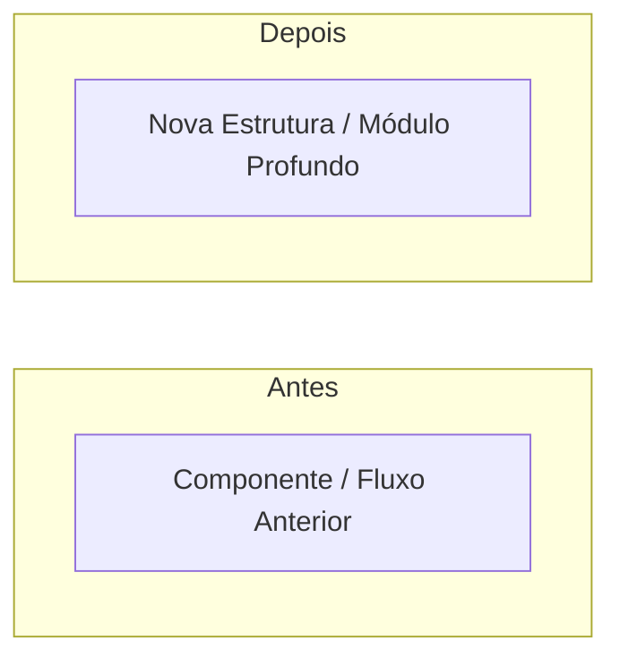

<!-- ==============================================================================
  antigravity-skills Registry — Supreme Pull Request Template
  Inspirado nos princípios de PR-Craftsman, Deep Modules e Governança Estrita.
============================================================================== -->

## 🚪 Triagem de Decisão & Raio de Explosão

- **Classificação**: 🔴 **Porta de Mão Única (Irreversível / Alto Risco)** | 🟢 **Porta de Mão Dupla (Reversível / Baixo Risco)**
- **Nível de Risco (Blast Radius)**: Tier 1 (Crítico/Core) | Tier 2 (Feature Interna) | Tier 3 (Folha/Documentação)
- **Justificativa de Risco**: <!-- 1-2 frases explicando a reversibilidade e impacto operacional -->
- **Plano de Rollback**: <!-- Sim, git revert imediato | Requer script ou intervenção manual -->
- **Domínios/Skills Afetados**: <!-- Ex: code-review, clean-architecture, CLI, etc. -->

---

## 🗺️ Visão Arquitetural das Alterações (Show Me)

<!-- Diagrama Mermaid ilustrando o fluxo, arquitetura ou comparação Antes x Depois -->

> *O diagrama visual orienta o revisor e acelera a compreensão cognitiva, sem substituir o detalhamento textual abaixo.*

---

## 🎯 Objetivo & Motivação

<!-- Resumo claro de 2 a 3 parágrafos explicando:
1. Qual problema ou oportunidade este PR resolve?
2. Por que esta abordagem foi escolhida?
3. Qual o benefício mensurável para os usuários ou agentes? -->

---

## 🔍 Guia para o Revisor ("Por onde começar a revisar")

<!-- Ordene os arquivos recomendados para leitura sequencial, reduzindo a fadiga do revisor: -->
1. Comece pela especificação/lente em `...`
2. Veja a implementação principal em `...`
3. Valide os testes e exemplos em `...`

---

## 🧩 Checklist de Simplicidade & Design (Anti-Overengineering)

- [ ] **Módulos Profundos**: A implementação esconde complexidade atrás de interfaces estreitas?
- [ ] **Sem Indireção Excessiva**: Foram evitadas cadeias anêmicas de repasse (`Controller -> UseCase -> Service -> Repo` sem regras de negócio)?
- [ ] **Sem Fragmentação**: Rotinas simples e coesas mantiveram sua localidade de leitura (sem micro-helpers de 2 linhas desnecessários)?
- [ ] **Regra de Três & YAGNI**: Não foram criadas abstrações/interfaces especulativas sem variação comprovada?
- [ ] **Interfaces Justificadas**: Todas as novas interfaces possuem múltiplos implementadores ou seam de teste real?

---

## 🛡️ Checklist de Governança & Qualidade do Repositório

- [ ] **Validação**: `npm run validate` executado e aprovado localmente (0 erros, 0 warnings).
- [ ] **SemVer**: Versão atualizada semanticamente no frontmatter do `SKILL.md`.
- [ ] **Changelog**: `CHANGELOG.md` da skill atualizado seguindo o formato *Keep a Changelog*.
- [ ] **Documentação**: `README.md` completo com propósito, uso, exemplos e limitações.
- [ ] **Exemplos & Testes**: Pelo menos um exemplo em `examples/` e um teste em `tests/`.
- [ ] **Idioma**: Interações com usuário em PT-BR; código, commits e arquivos internos em Inglês.
- [ ] **Segurança**: Nenhum segredo/token/chave comitada; permissões declaradas no frontmatter.
- [ ] **Commits**: Formato Conventional Commits (`feat(skill-name): ...`) com escopo e < 100 caracteres.
